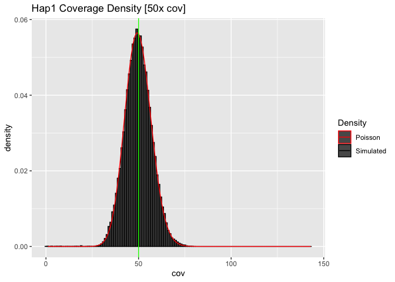

Low Coverage Variant Detection
================
mike\_schatz (<mschatz@cs.jhu.edu>)
2022-09-09

## Initalize the sequencing parameters

``` r
genome_length <- 100000
coverage <- 100
read_length <- 100
num_reads <- (genome_length * coverage) / read_length
print(paste0("Simulating ", coverage, "x coverage for a ", genome_length, "bp genome (", num_reads, " reads)"))
```

    ## [1] "Simulating 100x coverage for a 1e+05bp genome (1e+05 reads)"

## Initialize the read count and coverage for the two haplotypes as zero coverage for the entire genome\_length

``` r
hap_reads <- c(2:1) * 0
haplotype_coverage <- matrix(0, genome_length, 2)
```

## Now simulate the sequencing:

1.  pick a random haplotype (1 or 2)
2.  pick a random starting location for the read
3.  starting at that position increment coverage by 1 for a read length for that haplotype

``` r
for (x in 1:num_reads)
{
  haplotype <- sample.int(2, 1)
  read_pos <- sample.int(genome_length-read_length+1, 1)
  hap_reads[haplotype] <- hap_reads[haplotype]+1
  
  for (pos in read_pos:(read_pos+read_length-1))
  {
    haplotype_coverage[pos, haplotype] = haplotype_coverage[pos, haplotype] + 1
  }
}
```

## Summarize the coverage

    ## Read counts: 
    ##    hap1: 49953 hap2: 50047 total: 1e+05 
    ##  Covearge per haplotype:
    ##    hap1: 49.953 +/- 7.13 [expected sd: 7.068 ]
    ##    hap2: 50.047 +/- 7.197 [expected sd: 7.074 ]
    ##    total: 100 +/- 10.2 [expected sd: 10 ]

## Compute Possion approximation sequencing coverage

``` r
df <- data.frame(total=total_coverage, hap1=haplotype_coverage[,1], hap2=haplotype_coverage[,2])
max_coverage = max(total_coverage)
coverages=seq(1:max_coverage)
total_density = dpois(coverages, mean(df$total))
hap1_density  = dpois(coverages, mean(df$hap1))
hap2_density  = dpois(coverages, mean(df$hap2))
model <- data.frame(cov=coverages, total_density=total_density)
```

## Plot the total coverage distribution


## Plot the coverage distribution for Haplotype 1

#### (notice the mean coveage is exactly half of the total coverage over both haplotypes)



## Compute the recall of variants as a function of minimum support

#### e.g. if we require 3 reads to call a variant, what fraction of positions have this number of reads?

#### Note we can measure this directly from the simulation or use `ppois` to compute analytically

``` r
cov_cutoff <- 0:max_coverage
cov_avail <- rep(0,length(cov_cutoff))
for (x in cov_cutoff)
{
  cov_avail[x]=length(total_coverage[total_coverage >= cov_cutoff[x]])
}
df_cov <- data.frame(cutoff = cov_cutoff, avail=cov_avail, avail_perc=cov_avail/genome_length)
df_cov_model <- data.frame(cutoff = cov_cutoff, perc = (1-ppois(cov_cutoff-1, coverage)))
```


## 30x coverage analysis (coverage distribution + variant recall)


## 10x coverage analysis (coverage distribution + variant recall)


## 4x coverage analysis (coverage distribution + variant recall)


## Finally compute the recall as a function of minimum support and coverage

<table style="width:100%;">
<colgroup>
<col width="8%" />
<col width="6%" />
<col width="6%" />
<col width="6%" />
<col width="6%" />
<col width="6%" />
<col width="6%" />
<col width="6%" />
<col width="6%" />
<col width="6%" />
<col width="6%" />
<col width="6%" />
<col width="6%" />
<col width="6%" />
<col width="2%" />
</colgroup>
<thead>
<tr class="header">
<th align="right">min_support</th>
<th align="right">1</th>
<th align="right">2</th>
<th align="right">3</th>
<th align="right">4</th>
<th align="right">5</th>
<th align="right">6</th>
<th align="right">7</th>
<th align="right">8</th>
<th align="right">9</th>
<th align="right">10</th>
<th align="right">15</th>
<th align="right">20</th>
<th align="right">25</th>
<th align="right">30</th>
</tr>
</thead>
<tbody>
<tr class="odd">
<td align="right">0</td>
<td align="right">1.0000000</td>
<td align="right">1.0000000</td>
<td align="right">1.0000000</td>
<td align="right">1.0000000</td>
<td align="right">1.0000000</td>
<td align="right">1.0000000</td>
<td align="right">1.0000000</td>
<td align="right">1.0000000</td>
<td align="right">1.0000000</td>
<td align="right">1.0000000</td>
<td align="right">1.0000000</td>
<td align="right">1.0000000</td>
<td align="right">1.0000000</td>
<td align="right">1</td>
</tr>
<tr class="even">
<td align="right">1</td>
<td align="right">0.6321206</td>
<td align="right">0.8646647</td>
<td align="right">0.9502129</td>
<td align="right">0.9816844</td>
<td align="right">0.9932621</td>
<td align="right">0.9975212</td>
<td align="right">0.9990881</td>
<td align="right">0.9996645</td>
<td align="right">0.9998766</td>
<td align="right">0.9999546</td>
<td align="right">0.9999997</td>
<td align="right">1.0000000</td>
<td align="right">1.0000000</td>
<td align="right">1</td>
</tr>
<tr class="odd">
<td align="right">2</td>
<td align="right">0.2642411</td>
<td align="right">0.5939942</td>
<td align="right">0.8008517</td>
<td align="right">0.9084218</td>
<td align="right">0.9595723</td>
<td align="right">0.9826487</td>
<td align="right">0.9927049</td>
<td align="right">0.9969808</td>
<td align="right">0.9987659</td>
<td align="right">0.9995006</td>
<td align="right">0.9999951</td>
<td align="right">1.0000000</td>
<td align="right">1.0000000</td>
<td align="right">1</td>
</tr>
<tr class="even">
<td align="right">3</td>
<td align="right">0.0803014</td>
<td align="right">0.3233236</td>
<td align="right">0.5768099</td>
<td align="right">0.7618967</td>
<td align="right">0.8753480</td>
<td align="right">0.9380312</td>
<td align="right">0.9703638</td>
<td align="right">0.9862460</td>
<td align="right">0.9937678</td>
<td align="right">0.9972306</td>
<td align="right">0.9999607</td>
<td align="right">0.9999995</td>
<td align="right">1.0000000</td>
<td align="right">1</td>
</tr>
<tr class="odd">
<td align="right">4</td>
<td align="right">0.0189882</td>
<td align="right">0.1428765</td>
<td align="right">0.3527681</td>
<td align="right">0.5665299</td>
<td align="right">0.7349741</td>
<td align="right">0.8487961</td>
<td align="right">0.9182346</td>
<td align="right">0.9576199</td>
<td align="right">0.9787735</td>
<td align="right">0.9896639</td>
<td align="right">0.9997886</td>
<td align="right">0.9999968</td>
<td align="right">1.0000000</td>
<td align="right">1</td>
</tr>
<tr class="even">
<td align="right">5</td>
<td align="right">0.0036598</td>
<td align="right">0.0526530</td>
<td align="right">0.1847368</td>
<td align="right">0.3711631</td>
<td align="right">0.5595067</td>
<td align="right">0.7149435</td>
<td align="right">0.8270084</td>
<td align="right">0.9003676</td>
<td align="right">0.9450364</td>
<td align="right">0.9707473</td>
<td align="right">0.9991434</td>
<td align="right">0.9999831</td>
<td align="right">0.9999997</td>
<td align="right">1</td>
</tr>
</tbody>
</table>

## Plot recall as a function of minimum support and coverage


#### Note the recall is computed per haplotype for heterozygous variants.

#### e.g. With 4x coverage per haplotype, requiring a min support of 2, we expect to miss ~10% of heterozygous variants per haplotype, so in total we will miss 20% of heterozygous variants overall
