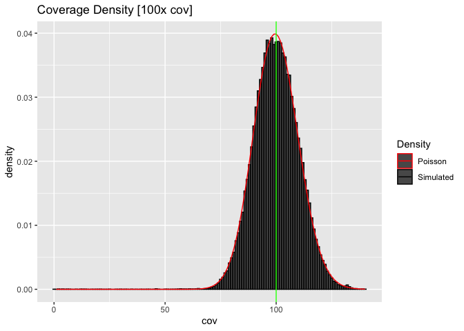
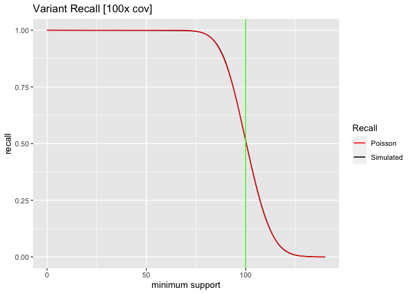

Low Coverage Variant Detection
================
mike_schatz (<mschatz@cs.jhu.edu>)
2022-09-09

## Initalize the sequencing parameters

``` r
genome_length <- 100000
coverage <- 100
read_length <- 100
num_reads <- (genome_length * coverage) / read_length
print(paste0("Simulating ", coverage, "x coverage for a ", genome_length, "bp genome (", num_reads, " reads)"))
```

    ## [1] "Simulating 100x coverage for a 1e+05bp genome (1e+05 reads)"

## Initialize the read count and coverage for the two haplotypes as zero coverage for the entire genome_length

``` r
hap_reads <- c(2:1) * 0
haplotype_coverage <- matrix(0, genome_length, 2)
```

## Now simulate the sequencing:

1.  pick a random haplotype (1 or 2)
2.  pick a random starting location for the read
3.  starting at that position increment coverage by 1 for a read length
    for that haplotype

``` r
for (x in 1:num_reads)
{
  haplotype <- sample.int(2, 1)
  read_pos <- sample.int(genome_length-read_length+1, 1)
  hap_reads[haplotype] <- hap_reads[haplotype]+1
  
  for (pos in read_pos:(read_pos+read_length-1))
  {
    haplotype_coverage[pos, haplotype] = haplotype_coverage[pos, haplotype] + 1
  }
}
```

## Summarize the coverage

    ## Read counts: 
    ##    hap1: 49797 hap2: 50203 total: 1e+05 
    ##  Coverage per haplotype:
    ##    hap1: 49.797 +/- 7.198 [expected sd: 7.057 ]
    ##    hap2: 50.203 +/- 7.283 [expected sd: 7.085 ]
    ##    total: 100 +/- 10.35 [expected sd: 10 ]

## Compute Possion approximation sequencing coverage

``` r
df <- data.frame(total=total_coverage, hap1=haplotype_coverage[,1], hap2=haplotype_coverage[,2])
max_coverage = max(total_coverage)
coverages=seq(1:max_coverage)
total_density = dpois(coverages, mean(df$total))
hap1_density  = dpois(coverages, mean(df$hap1))
hap2_density  = dpois(coverages, mean(df$hap2))
model <- data.frame(cov=coverages, total_density=total_density)
```

## Plot the total coverage distribution

    ## Warning: The dot-dot notation (`..density..`) was deprecated in ggplot2 3.4.0.
    ## ℹ Please use `after_stat(density)` instead.

<!-- -->

## Plot the coverage distribution for Haplotype 1

#### (notice the mean coveage is exactly half of the total coverage over both haplotypes)

<!-- -->

## Compute the recall of variants as a function of minimum support

#### e.g. if we require 3 reads to call a variant, what fraction of positions have this number of reads?

#### Note we can measure this directly from the simulation or use `ppois` to compute analytically

``` r
cov_cutoff <- 0:max_coverage
cov_avail <- rep(0,length(cov_cutoff))
for (x in cov_cutoff)
{
  cov_avail[x]=length(total_coverage[total_coverage >= cov_cutoff[x]])
}
df_cov <- data.frame(cutoff = cov_cutoff, avail=cov_avail, avail_perc=cov_avail/genome_length)
df_cov_model <- data.frame(cutoff = cov_cutoff, perc = (1-ppois(cov_cutoff-1, coverage)))
```

<!-- -->

## 30x coverage analysis (coverage distribution + variant recall)

<!-- -->

## 10x coverage analysis (coverage distribution + variant recall)

<!-- -->

## 5x coverage analysis (coverage distribution + variant recall)

<!-- -->

## Finally compute the recall as a function of minimum support and coverage

    ## Recall as a function of minimum support and total coverage

| min_support |         1 |         2 |         3 |         4 |         5 |         6 |         7 |         8 |         9 |        10 |        15 |        20 |        25 |  30 |
|------------:|----------:|----------:|----------:|----------:|----------:|----------:|----------:|----------:|----------:|----------:|----------:|----------:|----------:|----:|
|           0 | 1.0000000 | 1.0000000 | 1.0000000 | 1.0000000 | 1.0000000 | 1.0000000 | 1.0000000 | 1.0000000 | 1.0000000 | 1.0000000 | 1.0000000 | 1.0000000 | 1.0000000 |   1 |
|           1 | 0.6321206 | 0.8646647 | 0.9502129 | 0.9816844 | 0.9932621 | 0.9975212 | 0.9990881 | 0.9996645 | 0.9998766 | 0.9999546 | 0.9999997 | 1.0000000 | 1.0000000 |   1 |
|           2 | 0.2642411 | 0.5939942 | 0.8008517 | 0.9084218 | 0.9595723 | 0.9826487 | 0.9927049 | 0.9969808 | 0.9987659 | 0.9995006 | 0.9999951 | 1.0000000 | 1.0000000 |   1 |
|           3 | 0.0803014 | 0.3233236 | 0.5768099 | 0.7618967 | 0.8753480 | 0.9380312 | 0.9703638 | 0.9862460 | 0.9937678 | 0.9972306 | 0.9999607 | 0.9999995 | 1.0000000 |   1 |
|           4 | 0.0189882 | 0.1428765 | 0.3527681 | 0.5665299 | 0.7349741 | 0.8487961 | 0.9182346 | 0.9576199 | 0.9787735 | 0.9896639 | 0.9997886 | 0.9999968 | 1.0000000 |   1 |
|           5 | 0.0036598 | 0.0526530 | 0.1847368 | 0.3711631 | 0.5595067 | 0.7149435 | 0.8270084 | 0.9003676 | 0.9450364 | 0.9707473 | 0.9991434 | 0.9999831 | 0.9999997 |   1 |

## Plot recall as a function of minimum support and coverage

<!-- -->

#### Note the recall is computed per haplotype for heterozygous variants.

<!-- -->

#### Note the recall is computed per haplotype for heterozygous variants.

<!-- -->

## 10x coverage analysis (coverage distribution + variant recall)

<!-- -->
